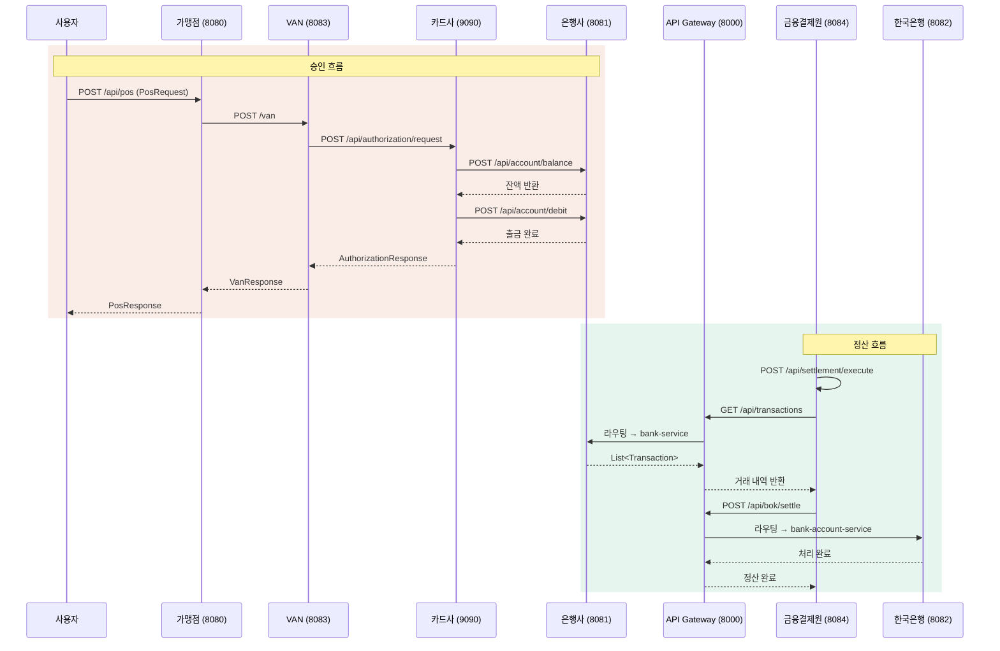

# FISA MSA 카드 결제 시스템

카드 결제의 전체 흐름(결제 요청 → 승인 → 정산)과 정산 과정을 MSA 아키텍처로 구현한 프로젝트입니다.
POS 단말기에서 시작된 결제 요청이 VAN → 카드사 → 은행을 거쳐 처리되고, 일일 정산까지 완결되는 구조를 다룹니다.

---

## MSA 구조도


---

## 서비스 구성

| 서비스 | 포트   | 설명 |
|--------|------|------|
| `eureka-server` | 8761 | 서비스 디스커버리 (Netflix Eureka) |
| `api-gateway` | 8000 | API 게이트웨이 (Spring Cloud Gateway) |
| `fisa-pos-server` | 8080 | POS 단말기 인터페이스, ISO8583 메시지 생성 |
| `van-server` | 8083 | VAN사 서버, ISO8583 파싱 및 카드사 중계 |
| `card-authorization-service` | 9090 | 카드 승인/거절 처리 |
| `bank-service` | 8081 | 계좌 잔액 조회 및 출금 처리 |
| `settlement-service` | 8084 | 일일 정산 처리 |
| `fisa-bank-account-service` | 8082 | 한은 당좌예금 계좌 입출금 |

---

## 기술 스택

- **Language**: Java 17
- **Framework**: Spring Boot 3.x / 4.x
- **Service Discovery**: Spring Cloud Netflix Eureka
- **API Gateway**: Spring Cloud Gateway
- **ORM**: Spring Data JPA + Hibernate
- **Database**: MySQL
- **HTTP Client**: Spring RestClient (Spring 6.0+)
- **Protocol**: ISO8583 (j8583 라이브러리)
- **API Docs**: SpringDoc OpenAPI (Swagger UI)
- **Build**: Gradle

---

## API 흐름 구조도


### API Gateway 라우팅

```
외부 요청 (:8000)
    │
    ├─ /api/account/**      → bank-service (:8081)
    ├─ /api/transactions/** → bank-service (:8081)
    ├─ /api/transfer/**     → bank-service (:8081)
    └─ /api/bok/**          → fisa-bank-account-service (:8082)
```

---

## API 엔드포인트

### POS Server
| Method | Endpoint | 설명 |
|--------|----------|------|
| POST | `/api/pos` | 결제 요청 (ISO8583 메시지 생성 및 VAN 전송) |

### VAN Server
| Method | Endpoint | 설명 |
|--------|----------|------|
| POST | `/van` | ISO8583 결제 요청 수신 및 카드사 중계 |

### Card Authorization Service
| Method | Endpoint | 설명 |
|--------|----------|------|
| POST | `/api/authorization/request` | 카드 승인/거절 처리 |

### Bank Service
| Method | Endpoint | 설명 |
|--------|----------|------|
| POST | `/api/account/balance` | 계좌 잔액 조회 |
| POST | `/api/account/debit` | 계좌 출금 처리 |
| GET | `/api/transactions?date={date}` | 날짜별 거래 내역 조회 |
| POST | `/api/transfer/request` | 계좌 이체 처리 |

### Settlement Service
| Method | Endpoint | 설명 |
|--------|----------|------|
| POST | `/api/settlement/execute` | 일일 정산 실행 |

### Bank Account Service
| Method | Endpoint | 설명 |
|--------|----------|------|
| POST | `/api/bok/settle` | 한은 당좌예금 정산 처리 |

---

## 승인 응답 코드

| 코드 | 의미 |
|------|------|
| `00` | 승인 |
| `14` | 계좌/카드 정지 |
| `51` | 잔액 부족 |
| `54` | 유효기간 만료 |
| `55` | PIN 오류 |
| `61` | 신용 한도 초과 |
| `96` | 시스템 오류 |

---

## 프로젝트 구조

```
fisa-msa/
├── eureka-server/                  # 서비스 디스커버리
├── api-gateway/                    # API 게이트웨이
├── fisa-pos-server/                # POS 단말기 서버
│   └── pay/
│       ├── PayController.java      # POST /api/pos
│       ├── PayService.java
│       └── iso8583/
│           └── VanClient.java      # VAN 서버 HTTP 클라이언트
├── van-server/                     # VAN 서버
│   └── domain/payment/
│       ├── controller/PaymentController.java   # POST /van
│       ├── service/PaymentService.java
│       └── service/CardClientService.java      # 카드사 HTTP 클라이언트
├── card-authorization-service/     # 카드 승인 서비스
│   └── authorization/
│       ├── controller/AuthorizationController.java  # POST /api/authorization/request
│       ├── service/AuthorizationService.java
│       ├── service/CardValidationService.java
│       └── client/BankClientImpl.java               # 은행 HTTP 클라이언트
├── bank-service/                   # 은행 서비스
│   └── bank/
│       ├── controller/AccountController.java     # POST /api/account/**
│       ├── controller/TransactionController.java # GET /api/transactions
│       ├── controller/TransferController.java    # POST /api/transfer/**
│       └── service/AccountService.java
├── settlement-service/             # 정산 서비스
│   └── domain/
│       ├── controller/SettlementController.java  # POST /api/settlement/execute
│       ├── service/SettlementService.java
│       ├── service/BankClientService.java         # 은행 HTTP 클라이언트
│       └── service/BankAccountClientService.java  # 한은 HTTP 클라이언트
└── fisa-bank-account-service/      # 한국은행 당좌예금 서비스
    └── BankAccountController.java  # POST /api/bok/settle
```


## 서비스 간 통신

모든 서비스 간 통신은 **Spring RestClient** (Spring 6.0+)를 사용합니다.

| 호출처 | 대상 | 엔드포인트 | 비고 |
|--------|------|-----------|------|
| POS Server | VAN Server | `POST /van` | ISO8583 (Base64) |
| VAN Server | Card Auth Service | `POST /api/authorization/request` | Basic Auth |
| Card Auth Service | Bank Service | `POST /api/account/balance` | 체크카드 전용 |
| Card Auth Service | Bank Service | `POST /api/account/debit` | 체크카드 전용 |
| Settlement Service | Bank Service | `GET /api/transactions` | 일일 배치 |
| Settlement Service | Bank Account Service | `POST /api/bok/settle` | 일일 배치 |

---


## 주요 특징

- **ISO8583 프로토콜**: POS ↔ VAN 간 금융 표준 메시지 포맷 사용 (j8583 라이브러리)
- **카드 타입 분기**: 체크카드는 은행 잔액 실시간 확인 후 출금, 신용카드는 한도 차감
- **정산 무결성 검증**: 모든 은행의 차액(net amount) 합계가 반드시 0이 되도록 검증
- **Basic Auth**: VAN → 카드사 구간 HTTP 기본 인증 적용
- **타임아웃 및 재시도**: 카드사의 은행 호출 시 잔액 조회 10초, 출금 30초 타임아웃 / 최대 1회 재시도
