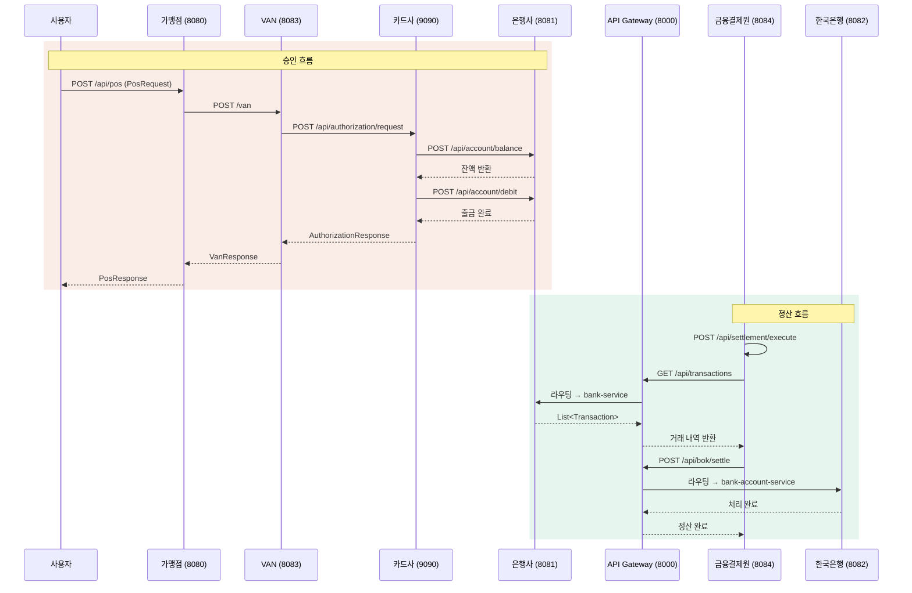

# FISA MSA 카드 결제 시스템

카드 결제의 승인 요청 흐름과 정산 과정을 MSA 아키텍처로 구현한 프로젝트입니다.
POS 단말기에서 시작된 결제 요청이 VAN → 카드사 → 은행을 거쳐 처리되고, 일일 정산까지 완결되는 구조를 다룹니다.

---

## MSA 구조도


---

## 서비스 구성

| 서비스 | 포트   | 설명 |
|--------|------|------|
| `eureka-server` | 8761 | 서비스 디스커버리 (Netflix Eureka) |
| `api-gateway` | 8000 | API 게이트웨이 (Spring Cloud Gateway) |
| `fisa-pos-server` | 8080 | POS 단말기 인터페이스, ISO8583 메시지 생성 |
| `van-server` | 8083 | VAN사 서버, ISO8583 파싱 및 카드사 중계 |
| `card-authorization-service` | 9090 | 카드 승인/거절 처리 |
| `bank-service` | 8081 | 계좌 잔액 조회 및 출금 처리 |
| `settlement-service` | 8084 | 일일 정산 처리 |
| `fisa-bank-account-service` | 8082 | 한은 당좌예금 계좌 입출금 |

---

## 기술 스택

- **Language**: Java 17
- **Framework**: Spring Boot 3.x / 4.x
- **Service Discovery**: Spring Cloud Netflix Eureka
- **API Gateway**: Spring Cloud Gateway
- **ORM**: Spring Data JPA + Hibernate
- **Database**: MySQL
- **HTTP Client**: Spring RestClient (Spring 6.0+)
- **Protocol**: ISO8583 (j8583 라이브러리)
- **API Docs**: SpringDoc OpenAPI (Swagger UI)
- **Build**: Gradle

---

## API 흐름 구조도


### API Gateway 라우팅

```
외부 요청 (:8000)
    │
    ├─ /api/account/**      → bank-service (:8081)
    ├─ /api/transactions/** → bank-service (:8081)
    ├─ /api/transfer/**     → bank-service (:8081)
    └─ /api/bok/**          → fisa-bank-account-service (:8082)
```

---

## API 엔드포인트

### POS Server
| Method | Endpoint | 설명 |
|--------|----------|------|
| POST | `/api/pos` | 결제 요청 (ISO8583 메시지 생성 및 VAN 전송) |

### VAN Server
| Method | Endpoint | 설명 |
|--------|----------|------|
| POST | `/van` | ISO8583 결제 요청 수신 및 카드사 중계 |

### Card Authorization Service
| Method | Endpoint | 설명 |
|--------|----------|------|
| POST | `/api/authorization/request` | 카드 승인/거절 처리 |

### Bank Service
| Method | Endpoint | 설명 |
|--------|----------|------|
| POST | `/api/account/balance` | 계좌 잔액 조회 |
| POST | `/api/account/debit` | 계좌 출금 처리 |
| GET | `/api/transactions?date={date}` | 날짜별 거래 내역 조회 |
| POST | `/api/transfer/request` | 계좌 이체 처리 |

### Settlement Service
| Method | Endpoint | 설명 |
|--------|----------|------|
| POST | `/api/settlement/execute` | 일일 정산 실행 |

### Bank Account Service
| Method | Endpoint | 설명 |
|--------|----------|------|
| POST | `/api/bok/settle` | 한은 당좌예금 정산 처리 |

---

## 승인 응답 코드

| 코드 | 의미 |
|------|------|
| `00` | 승인 |
| `14` | 계좌/카드 정지 |
| `51` | 잔액 부족 |
| `54` | 유효기간 만료 |
| `55` | PIN 오류 |
| `61` | 신용 한도 초과 |
| `96` | 시스템 오류 |

---

## 프로젝트 구조

```
fisa-msa/
├── eureka-server/                  # 서비스 디스커버리
├── api-gateway/                    # API 게이트웨이
├── fisa-pos-server/                # POS 단말기 서버
│   └── pay/
│       ├── PayController.java      # POST /api/pos
│       ├── PayService.java
│       └── iso8583/
│           └── VanClient.java      # VAN 서버 HTTP 클라이언트
├── van-server/                     # VAN 서버
│   └── domain/payment/
│       ├── controller/PaymentController.java   # POST /van
│       ├── service/PaymentService.java
│       └── service/CardClientService.java      # 카드사 HTTP 클라이언트
├── card-authorization-service/     # 카드 승인 서비스
│   └── authorization/
│       ├── controller/AuthorizationController.java  # POST /api/authorization/request
│       ├── service/AuthorizationService.java
│       ├── service/CardValidationService.java
│       └── client/BankClientImpl.java               # 은행 HTTP 클라이언트
├── bank-service/                   # 은행 서비스
│   └── bank/
│       ├── controller/AccountController.java     # POST /api/account/**
│       ├── controller/TransactionController.java # GET /api/transactions
│       ├── controller/TransferController.java    # POST /api/transfer/**
│       └── service/AccountService.java
├── settlement-service/             # 정산 서비스
│   └── domain/
│       ├── controller/SettlementController.java  # POST /api/settlement/execute
│       ├── service/SettlementService.java
│       ├── service/BankClientService.java         # 은행 HTTP 클라이언트
│       └── service/BankAccountClientService.java  # 한은 HTTP 클라이언트
└── fisa-bank-account-service/      # 한국은행 당좌예금 서비스
    └── BankAccountController.java  # POST /api/bok/settle
```


## 서비스 간 통신

모든 서비스 간 통신은 **Spring RestClient** (Spring 6.0+)를 사용합니다.

| 호출처 | 대상 | 엔드포인트 | 비고 |
|--------|------|-----------|------|
| POS Server | VAN Server | `POST /van` | ISO8583 (Base64) |
| VAN Server | Card Auth Service | `POST /api/authorization/request` | Basic Auth |
| Card Auth Service | Bank Service | `POST /api/account/balance` | 체크카드 전용 |
| Card Auth Service | Bank Service | `POST /api/account/debit` | 체크카드 전용 |
| Settlement Service | Bank Service | `GET /api/transactions` | 일일 배치 |
| Settlement Service | Bank Account Service | `POST /api/bok/settle` | 일일 배치 |

---


## 주요 특징

### 1. ISO8583 메시지 구성

#### ISO8583이란?

ISO8583은 금융 거래 메시지를 위한 국제 표준 프로토콜입니다.
카드 결제 시 POS 단말기와 VAN사 사이에서 실제로 사용되는 전문(電文) 포맷으로,
메시지 타입(MTI) + 비트맵 + 데이터 필드(DE) 구조로 구성됩니다.

```
[ MTI (4byte) ][ Bitmap (8~16byte) ][ DE2 ][ DE4 ][ DE37 ][ DE41 ][ DE42 ] ...
```
#### ISO8583 전문 구성

| DE | 필드명 | 설명 | 예시 |
|----|--------|------|------|
| 2 | Card Number | 카드번호 (LLVAR) | 4111111111111111 |
| 4 | Amount | 결제 금액 | 000000010000 |
| 37 | Transaction ID | 거래 ID (ALPHA 12) | 048231 |
| 41 | Terminal ID | 단말기 ID (ALPHA 8) | TERM0001 |
| 42 | Merchant ID | 가맹점 ID (ALPHA 15) | MERCHANT000001 |

---

### 2. POS Server - 메시지 생성

결제 요청 시 j8583 라이브러리를 사용해 ISO8583 메시지를 생성합니다.

```java
// Iso8583MessageBuilder.java
MessageFactory<IsoMessage> factory = new MessageFactory<>();
factory.setUseBinaryMessages(false);  // ASCII 모드

IsoMessage isoMessage = factory.newMessage(0x0200);  // MTI 0200: 승인 요청

isoMessage.setValue(2,  cardNumber,     IsoType.LLVAR,  0);   // DE2:  카드번호
isoMessage.setValue(4,  amount,         IsoType.AMOUNT, 0);   // DE4:  거래금액
isoMessage.setValue(37, transactionId,  IsoType.ALPHA,  12);  // DE37: 거래 고유번호
isoMessage.setValue(41, terminalId,     IsoType.ALPHA,  8);   // DE41: 단말기 ID
isoMessage.setValue(42, merchantId,     IsoType.ALPHA,  15);  // DE42: 가맹점 ID

byte[] messageBytes = isoMessage.writeData();
```

생성된 바이트 배열은 **Base64로 인코딩**하여 VAN 서버로 HTTP 전송합니다.

```java
// VanClient.java
String encodedMessage = Base64.getEncoder().encodeToString(iso8583Message);
VanRequest request = VanRequest.builder()
        .rawIsoMessage(encodedMessage)
        .build();
```

---

### 3. VAN Server - 메시지 파싱

VAN 서버는 수신한 메시지를 j8583 설정 파일(`j8583.xml`) 기반으로 파싱합니다.

```xml
<!-- j8583.xml -->
<j8583-config>
    <parse type="0200">
        <field num="2"  type="LLVAR" />           <!-- 카드번호 -->
        <field num="4"  type="AMOUNT" />           <!-- 거래금액 -->
        <field num="37" type="NUMERIC" length="6" />  <!-- 거래 고유번호 -->
        <field num="41" type="ALPHA"   length="8" />  <!-- 단말기 ID -->
        <field num="42" type="ALPHA"   length="15" /> <!-- 가맹점 ID -->
    </parse>
</j8583-config>
```

```java
// PaymentController.java
messageFactory = ConfigParser.createFromClasspathConfig("j8583.xml");

IsoMessage parsedMsg = messageFactory.parseMessage(messageBytes, 0);

String cardNumber     = parsedMsg.getObjectValue(2).toString();   // DE2
BigDecimal amount     = new BigDecimal(parsedMsg.getObjectValue(4).toString());  // DE4
String transactionId  = parsedMsg.getObjectValue(37).toString();  // DE37
String terminalId     = parsedMsg.getObjectValue(41).toString();  // DE41
String merchantId     = parsedMsg.getObjectValue(42).toString();  // DE42
```

파싱된 데이터는 `AuthorizationRequest`로 변환되어 카드사(card-authorization-service)로 전달됩니다.


---
### 4. Eureka Server - 서비스 디스커버리

각 서비스가 IP/포트를 직접 명시하지 않고, 서비스 이름으로 서로를 찾을 수 있도록 Eureka Server를 사용했습니다.

```yaml
# eureka-server/application.yaml
server:
  port: 8761

eureka:
  client:
    register-with-eureka: false   # 자기 자신은 등록 안 함
    fetch-registry: false
  server:
    eviction-interval-timer-in-ms: 5000  # 5초마다 비정상 서비스 제거
```

각 서비스는 Eureka에 자신을 등록하고, 호출 시 서비스 이름으로 조회합니다.

```yaml
# 각 서비스 공통 설정
eureka:
  client:
    service-url:
      defaultZone: http://localhost:8761/eureka/
```

**실행 순서 상 Eureka Server가 가장 먼저 실행**되어야 다른 서비스들이 정상 등록됩니다.

---

### 5. API Gateway - 단일 진입점

외부에서 들어오는 요청을 서비스 이름 기반으로 라우팅합니다.
`lb://` 접두사를 통해 Eureka에 등록된 서비스를 로드밸런싱으로 호출합니다.

```yaml
# api-gateway/application.yaml
server:
  port: 8000

spring:
  cloud:
    gateway:
      routes:
        - id: bank-service
          uri: lb://bank-service          # Eureka에서 서비스 이름으로 조회
          predicates:
            - Path=/api/account/**, /api/transactions/**, /api/transfer/**

        - id: bank-account-service
          uri: lb://bank-account-service
          predicates:
            - Path=/api/bok/**
```

**라우팅 규칙 요약**

```
외부 요청 (port: 8000)
    │
    ├─ /api/account/**      → bank-service
    ├─ /api/transactions/** → bank-service
    ├─ /api/transfer/**     → bank-service
    └─ /api/bok/**          → fisa-bank-account-service
```

---

### 6. Netting 기반 정산 계산

#### Netting이란?

건별로 은행 간 자금을 이체하는 대신, **하루치 거래를 모아 차액(Net)만 정산**하는 방식입니다.
예를 들어 A은행 → B은행 이체 100건, B은행 → A은행 이체 80건이 있다면
실제 이동하는 금액은 차액 1건뿐입니다.

---

### Settlement Service 구현

```java
// SettlementService.java

// 1. 해당 날짜 거래 내역 전체 수집
List<TransactionDto> transactions = bankClientService.getTransactionsByDate(date);

// 2. 은행 코드별로 그룹화
Map<String, List<TransactionDto>> groupedByBank =
    transactions.stream()
                .collect(Collectors.groupingBy(TransactionDto::bankCode));

List<AdjustRequest> adjustRequests = new ArrayList<>();
BigDecimal checkSum = BigDecimal.ZERO;

for (Map.Entry<String, List<TransactionDto>> entry : groupedByBank.entrySet()) {
    String bankCode = entry.getKey();
    BigDecimal totalDebit  = BigDecimal.ZERO;  // 줄 돈 (출금)
    BigDecimal totalCredit = BigDecimal.ZERO;  // 받을 돈 (입금)

    for (TransactionDto tx : entry.getValue()) {
        if ("WITHDRAWAL".equals(tx.transactionType())) {
            totalDebit = totalDebit.add(tx.amount());
        } else if ("DEPOSIT".equals(tx.transactionType())) {
            totalCredit = totalCredit.add(tx.amount());
        }
    }

    // 3. 차액(Net) 계산
    BigDecimal netAmount = totalCredit.subtract(totalDebit);
    checkSum = checkSum.add(netAmount);

    adjustRequests.add(new AdjustRequest(bankCode, netAmount));
}

// 4. 무결성 검증 - 모든 차액의 합은 반드시 0
if (checkSum.compareTo(BigDecimal.ZERO) != 0) {
    return new SettlementResponse(date, totalCount, totalAmount, "FAILED_CHECKSUM_ERROR");
}

// 5. 한국은행 당좌예금 계좌 업데이트 요청
bankAccountClientService.sendAdjustments(adjustRequests);
```

---

### Bank Account Service - 실제 계좌 처리

settlement-service로부터 은행별 차액을 받아 한은 당좌예금 계좌를 업데이트합니다.

```java
// BankAccountService.java
for (DeductRequest request : requests) {
    Account account = accountRepository.findByBankCode(request.getBankCode());

    if (request.getNetAmount().compareTo(BigDecimal.ZERO) > 0) {
        account.deposit(request.getNetAmount());   // 양수 → 입금
    } else {
        account.deduct(request.getNetAmount().abs()); // 음수 → 출금
    }
}
```

---

### 정산 흐름 예시

| 은행 | 출금 합계 | 입금 합계 | 차액 (Net) | 한은 당좌 처리 |
|------|---------|---------|-----------|-------------|
| A은행 | 500만원 | 300만원 | **-200만원** | 200만원 차감 |
| B은행 | 200만원 | 400만원 | **+200만원** | 200만원 입금 |
| **합계** | | | **0** | 무결성 통과 |

> 차액의 합이 0이 아니면 `FAILED_CHECKSUM_ERROR`를 반환하고 정산을 중단합니다.
